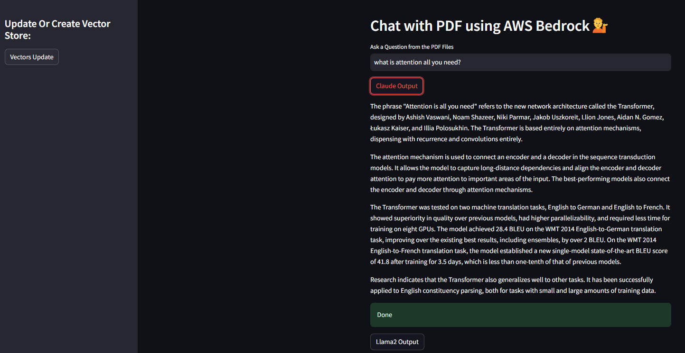

# Chat with PDF using AWS Bedrock

This project implements a Streamlit application that allows users to chat with PDF documents using AWS Bedrock's AI services. It utilizes various AI models for text embedding and question answering, providing an interactive interface for document analysis and information retrieval.

## Features

- PDF document ingestion and processing
- Text embedding using AWS Bedrock's Titan Embedding Model
- Vector storage using FAISS (Facebook AI Similarity Search)
- Question answering capability using AWS Bedrock's Claude and Llama 2 models
- Interactive Streamlit interface for easy user interaction

## Prerequisites

- Python 3.12
- AWS account with access to Bedrock services
- AWS CLI configured with appropriate credentials

## Installation

1. Clone the repository:
   ```
   git clone https://github.com/HimelDGupta/Document-QA-With-Langchain-Rag-and-AWS-Bedrock.git
   cd chat-with-pdf-bedrock
   ```

2. Create and activate a virtual environment:
   ```
   python -m venv venv
   source venv/bin/activate  # On Windows, use `venv\Scripts\activate`
   ```

3. Install the required packages:
   ```
   pip install -r requirements.txt
   ```

## Configuration

1. Ensure your AWS CLI is configured with the correct credentials and region:
   ```
   aws configure
   ```

2. Place your PDF documents in the `data` directory.

## Usage

1. Run the Streamlit app:
   ```
   streamlit run app.py
   ```

2. Open your web browser and navigate to the URL provided by Streamlit (usually `http://localhost:8501`).

3. Use the sidebar to update or create the vector store if needed.

4. Enter your question in the text input field.

5. Click on either "Claude Output" or "Llama2 Output" to get answers based on the respective AI models.

   

## Project Structure

- `app.py`: Main application file containing the Streamlit interface and core functionality.
- `data/`: Directory to store PDF documents for processing.
- `faiss_index/`: Directory where the FAISS index is saved and loaded from.

## Important Notes

- Ensure that your AWS account has the necessary permissions to access Bedrock services.
- The application uses local storage for the FAISS index. Make sure you have sufficient disk space.
- Be cautious when loading serialized data and only use trusted sources.

## Contributing

Contributions to this project are welcome. Please fork the repository and submit a pull request with your changes.

## License

[MIT]

## Disclaimer

This project is for educational and demonstration purposes. Ensure compliance with AWS Bedrock's terms of service and handle sensitive information appropriately.
